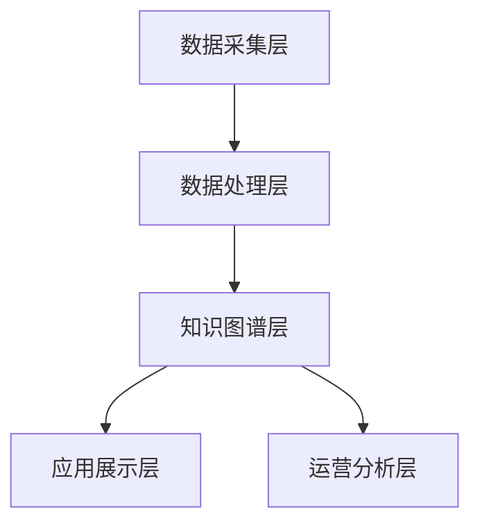

# 个人健康知识图谱系统技术文档

## 1. 系统概述

本技术文档详细阐述了“个人健康知识图谱系统”的架构设计、技术选型、模块实现、部署和监控方案。本文档面向开发人员、架构师和运维工程师，旨在为系统的开发、部署和维护提供全面的技术指引。

### 1.1. 总体架构

系统采用分层架构，自下而上依次为数据采集层、数据处理层、知识图谱层、应用展示层和运营分析层。这种设计确保了模块的低耦合和高内聚，便于独立开发、测试和扩展。

### 1.2. 技术栈

为了实现上述架构，系统选用了一系列成熟且高效的技术组件，具体如下表所示：

| 分类 | 技术/组件 | 用途 |
| :--- | :--- | :--- |
| **数据存储** | MongoDB | 存储非结构化和半结构化的原始数据，如用户基本信息和通话记录。 |
| | Neo4j | 作为核心的图数据库，用于存储和管理实体与关系，构建知识图谱。 |
| **核心处理** | Python FastAPI | 作为后端API服务框架，提供高性能的HTTP接口。 |
| | Celery & Redis | 用于处理耗时的异步任务，如调用LLM进行知识提取，避免阻塞主应用。 |
| **LLM服务** | OpenAI GPT-4 / Claude 3 | 用于从非结构化文本中进行复杂的实体和关系提取。支持切换为本地部署模型。 |
| **可视化** | Kumu / Neo4j Bloom | 用于知识图谱的可视化探索和展示。 |
| **监控** | Prometheus & Grafana | 负责收集系统运行指标并提供可视化的监控看板。 |

## 2. 数据库设计

### 2.1. MongoDB 文档模型

MongoDB用于存储需要频繁写入且结构灵活的数据。主要设计了两个集合：

- **`users` 集合**: 存储用户的静态基础信息、联系方式和部分医疗档案。`user_id` 作为唯一标识符。
- **`conversation_records` 集合**: 存储医患对话的完整记录。`session_id` 唯一标识一次会话，并通过 `user_id` 与用户关联。`processed` 和 `processing_status` 字段用于追踪知识提取任务的状态。

### 2.2. Neo4j 图模型

Neo4j是系统的核心，用于构建个人健康知识图谱。其模型设计遵循属性图模型（Property Graph Model）。

- **节点 (Nodes)**: 代表实体。核心节点包括 `User`, `Symptom`, `Disease`, `Medication`, `Test`, `Lifestyle`, `Advice` 等。每个节点都有一组描述其特征的属性。
- **关系 (Relationships)**: 代表实体间的联系。关系是带方向的，并且可以拥有属性。例如，`(User)-[HAS_SYMPTOM]->(Symptom)` 这条关系可以拥有 `onset` (发作时间)、`severity` (严重程度) 等属性，以记录更丰富的信息。

**核心关系类型包括：**
- 用户与健康实体：`HAS_SYMPTOM`, `HAS_DIAGNOSIS`, `USES_MEDICATION`
- 医学逻辑关系：`SYMPTOM_OF`, `TREATS`, `CAUSED_BY`
- 数据溯源关系：`CONTAINS_KNOWLEDGE`, `RECORDS`

## 3. 核心模块实现

### 3.1. 知识提取管道 (HealthKnowledgeExtractor)

这是系统的智能核心，通过一个定义良好的管道流程，将非结构化的对话文本转化为结构化的知识。该过程通过 `HealthKnowledgeExtractor` 类实现，封装了以下关键步骤：

1.  **对话预处理 (`preprocess_conversation`)**: 将原始对话数据格式化，为每个对话回合添加角色（“患者”/“医生”）前缀，合并成单一的文本字符串，以便于LLM理解上下文。
2.  **实体提取 (`extract_entities`)**: 调用LLM，使用精心设计的 `ENTITY_EXTRACTION_PROMPT` 提示词模板，从预处理后的文本中识别出医疗实体。该提示词明确定义了实体类型、输出格式（JSON）以及需要包含的属性（如置信度、原文片段）。
3.  **关系提取 (`extract_relations`)**: 在实体提取的基础上，再次调用LLM，使用 `RELATION_EXTRACTION_PROMPT` 提示词模板，识别并抽取出实体之间的逻辑关系。
4.  **医学术语标准化 (`standardize_medical_terms`)**: 将LLM提取出的口语化、非标准的实体名称（如“头疼”），与内置的医学术语库进行匹配，映射为标准术语（如“头痛”），以保证数据的一致性。
5.  **质量检查与过滤 (`quality_check`)**: 基于预设的置信度阈值（例如0.7）过滤掉低质量的提取结果，并执行逻辑一致性检查，确保知识的准确性。

### 3.2. 图数据库管理 (KnowledgeGraphManager)

该模块负责将提取出的结构化知识持久化到Neo4j图数据库中。`KnowledgeGraphManager` 类提供了与数据库交互的核心方法：

- **`update_user_knowledge_graph`**: 事务性地将一次对话的提取结果更新到用户的图谱中。它协调多个子操作，包括创建或更新用户节点、实体节点以及它们之间的关系。
- **原子操作**: 使用 `MERGE` Cypher语句来创建或更新节点，确保了操作的幂等性，避免了重复创建。例如，`MERGE (u:User {user_id: $user_id})` 会查找 `user_id` 匹配的用户，如果不存在则创建新节点。
- **冲突处理 (`_handle_knowledge_conflicts`)**: 定义了处理知识冲突的策略。例如，当新的信息与图中已有信息矛盾时（如一个症状的状态从“持续中”变为“已缓解”），系统会根据时间戳或信息来源的权重来更新关系属性，而不是简单地创建一条新关系。

### 3.3. API 服务

系统通过FastAPI提供一组RESTful API接口，供前端或其他服务调用。

- **`POST /api/knowledge/extract`**: 接收原始对话数据，直接返回知识提取结果。主要用于调试和快速验证。
- **`POST /api/conversations/{session_id}/process`**: 接收一个会话ID，触发一个后台异步任务（通过Celery），对指定的对话记录执行完整的知识提取和图谱更新流程。这是生产环境中的主要数据处理入口。
- **`GET /api/users/{user_id}/knowledge-graph`**: 根据用户ID，从Neo4j中查询其个人健康知识图谱，并将其格式化为前端可视化库（如Cytoscape.js）所需的JSON格式后返回。

## 4. 部署与监控

### 4.1. 容器化部署

系统所有服务（数据库、API服务器、任务队列）都被设计为可通过Docker进行容器化部署。项目根目录下的 `docker-compose.yml` 文件定义了整个应用的架构和服务依赖关系，使得一键启动整个系统成为可能。

- **服务依赖**: `api-server` 和 `celery-worker` 服务都依赖于 `mongodb` 和 `neo4j` 服务，Compose会确保数据库服务先于应用服务启动。
- **数据持久化**: 使用Docker volumes (`mongodb_data`, `neo4j_data`) 来持久化数据库内容，确保容器重启后数据不会丢失。
- **配置管理**: 数据库连接信息等敏感配置通过环境变量注入到应用容器中，增强了安全性。

### 4.2. 系统监控

为了确保系统的稳定运行和服务质量，定义了以下关键监控指标，这些指标将通过Prometheus收集，并在Grafana中进行可视化展示。

- **知识提取准确率 (extraction_accuracy)**: 通过定期人工抽样评估或与黄金标准数据集对比，衡量LLM提取结果的精确度和召回率。
- **处理延迟 (processing_latency)**: 从接收到对话记录到完成知识图谱更新的端到端时间。
- **知识新鲜度 (knowledge_freshness)**: 图谱中数据与现实世界信息同步的时间差。
- **用户覆盖率 (user_coverage)**: 已成功构建知识图谱的用户占总用户数的比例。
- **系统可用性 (system_availability)**: API接口和关键服务的在线运行时间比例。

## 5. 分阶段实施与前端验收

为了确保开发过程的透明性和可控性,技术实施将严格按照三个阶段进行,每个阶段都有明确的技术交付物和可在前端验收的功能点。

### 5.1. 阶段一:数据采集与处理核心(1-2个月)

#### 技术目标

建立系统的数据基础设施和核心的知识提取能力。这一阶段的重点是搭建完整的数据流管道,从数据接收到知识提取,确保整个流程的可靠性和准确性。

#### 技术交付物

- **MongoDB数据库部署**: 完成MongoDB的安装、配置和初始化,创建 users 和 conversation_records 两个核心集合,并建立必要的索引以优化查询性能。
- **FastAPI服务框架**: 搭建基础的API服务,实现以下接口:
  - POST /api/conversations/upload: 接收并存储对话记录。
  - POST /api/knowledge/extract: 调用知识提取服务,返回提取结果。
- **LLM知识提取服务**: 实现 HealthKnowledgeExtractor 类,集成OpenAI API或其他LLM服务,完成实体和关系的提取逻辑。
- **医学术语库**: 构建或集成一个基础的医学术语标准化词典,用于将口语化表达映射为标准医学术语。

#### 前端验收功能

- **对话上传页面**: 前端开发一个简单的表单页面,包含文本输入框和"上传"按钮。用户输入对话内容后,点击按钮,前端通过 POST /api/conversations/upload 接口将数据提交到后端。成功后,页面显示"上传成功"消息和返回的 session_id。
- **知识提取调试页面**: 前端开发一个调试工具页面,包含文本输入框和"提取知识"按钮。用户输入对话内容或 session_id,点击按钮后,前端调用 POST /api/knowledge/extract 接口,并将返回的JSON数据以表格形式展示,表格包含以下列:
  - 实体表格:实体名称、实体类型、置信度、原文来源
  - 关系表格:关系类型、起点实体、终点实体、置信度

#### 技术验收标准

- 能够成功处理至少10条不同长度和内容的对话记录,无系统错误。
- 对于预定义的测试数据集,实体识别的F1分数达到0.8以上,关系抽取的F1分数达到0.75以上。
- API接口的平均响应时间(不含LLM调用时间)小于100ms。

### 5.2. 阶段二:个人健康图谱构建与可视化(2-3个月)

#### 技术目标

将第一阶段提取的知识结构化存储到图数据库中,并提供可视化的前端界面,让用户能够直观地浏览和探索自己的健康知识图谱。

#### 技术交付物

- **Neo4j图数据库部署**: 完成Neo4j的安装和配置,定义节点和关系的Schema,创建必要的索引和约束。
- **KnowledgeGraphManager模块**: 实现图数据库的CRUD操作,包括:
  - update_user_knowledge_graph: 将提取结果写入图数据库。
  - export_knowledge_graph: 从图数据库中查询用户的知识图谱,并格式化为前端可视化库所需的JSON格式(如Cytoscape.js格式)。
  - _handle_knowledge_conflicts: 实现知识冲突检测和解决逻辑。
- **Celery异步任务队列**: 部署Redis和Celery,实现异步的对话处理任务,避免长时间阻塞API请求。
- **图谱数据导出API**: 实现以下接口:
  - GET /api/users/{user_id}/knowledge-graph: 返回指定用户的知识图谱数据。
  - POST /api/conversations/{session_id}/process: 触发异步任务,处理指定对话并更新图谱。

#### 前端验收功能

- **用户详情页**: 前端开发一个用户详情页,展示用户的基本信息(从MongoDB查询)。页面包含一个"处理新对话"按钮,点击后,前端调用 POST /api/conversations/{session_id}/process 接口,触发后台异步任务。前端通过轮询或WebSocket实时显示任务状态("处理中"、"已完成"、"失败")。
- **我的健康图谱页面**: 前端使用图可视化库(如Cytoscape.js、D3.js或Kumu嵌入)开发一个交互式图谱页面。页面加载时,调用 GET /api/users/{user_id}/knowledge-graph 接口获取数据,并渲染图谱。图谱支持以下交互:
  - 拖动节点调整布局
  - 滚轮缩放图谱
  - 点击节点,在侧边栏显示节点的详细属性(如症状的严重程度、诊断日期等)
  - 点击关系边,显示关系的详细属性(如用药的剂量、频率等)

#### 技术验收标准

- 对于一个测试用户,连续提交3次不同的对话记录,系统能够正确地将所有提取的实体和关系增量更新到图数据库中,且不产生重复节点。
- 知识冲突处理逻辑能够正确识别并解决至少3种常见的冲突场景(如症状状态变化、药物剂量调整)。
- 图谱可视化页面能够在2秒内加载并渲染包含50个节点和100条关系的图谱,且交互操作(拖动、缩放、点击)响应时间小于100ms。
- Celery任务队列能够稳定运行,处理任务的失败率低于1%。

### 5.3. 阶段三:健康看板与运营监控(1-2个月)

#### 技术目标

在核心功能完备的基础上,提供面向用户的健康分析看板和面向管理员的系统运营监控看板,提升系统的用户体验和可维护性。

#### 技术交付物

- **健康数据聚合服务**: 实现 OperationsDashboard 类,提供以下方法:
  - get_user_health_overview: 查询并聚合用户的健康概览数据(症状数、疾病数、用药数等)。
  - get_health_timeline: 查询用户的健康事件时间线。
- **API接口扩展**: 实现以下接口:
  - GET /api/users/{user_id}/health-overview: 返回用户的健康概览数据。
  - GET /api/users/{user_id}/health-timeline: 返回用户的健康时间线数据。
  - GET /api/admin/metrics: 返回系统的运营指标数据(仅管理员可访问)。
- **Prometheus监控集成**: 在API服务中集成Prometheus客户端,暴露关键指标(如请求数、响应时间、任务队列长度等)。
- **Grafana看板配置**: 部署Grafana,并配置预定义的监控看板,包含以下图表:
  - 系统可用性(Uptime)
  - API请求量和响应时间分布
  - 知识提取任务的处理速度和成功率
  - 用户增长趋势
  - 数据库连接池状态

#### 前端验收功能

- **个人健康看板**: 前端开发用户首页,作为登录后的默认页面。页面布局包括:
  - 顶部:3-4个信息卡片,分别展示"当前症状数"、"确诊疾病数"、"正在使用的药物数"等关键指标。数据通过调用 GET /api/users/{user_id}/health-overview 接口获取。
  - 下方:一个时间线组件,展示用户的健康事件历史。数据通过调用 GET /api/users/{user_id}/health-timeline 接口获取。时间线按时间倒序排列,每个事件显示日期、事件类型(如"咨询医生"、"新诊断")和简要描述。点击事件可展开查看详细信息。
- **运营分析看板**: 前端开发一个受密码保护的后台管理页面(仅管理员可访问)。页面包含多个图表,数据通过调用 GET /api/admin/metrics 接口获取,或直接嵌入Grafana的iframe。图表包括:
  - 过去24小时处理的对话数量(折线图)
  - 平均知识提取置信度(仪表盘)
  - API响应时间分布(直方图)
  - 当前在线用户数(实时数字)
  - 系统错误日志(表格,最近10条)

#### 技术验收标准

- 个人健康看板的数据加载时间小于1秒,且数据与数据库中的实际记录完全一致。
- 健康时间线能够正确展示用户的所有健康事件,且时间排序准确无误。
- 运营分析看板中的所有指标能够实时更新(延迟不超过1分钟),且与后台日志和数据库记录一致。
- Prometheus能够成功采集所有定义的指标,Grafana看板能够正常显示所有图表。
- 系统在模拟100个并发用户的负载测试下,API的P95响应时间仍小于500ms,且无错误发生。

## 6. 数据安全与隐私保护

鉴于系统处理的是高度敏感的个人健康数据,必须在技术层面实施严格的安全措施。

### 6.1. 数据加密

- **传输加密**: 所有客户端与服务器之间的通信必须使用TLS 1.3或更高版本的HTTPS协议,确保数据在传输过程中不被窃听或篡改。
- **存储加密**: MongoDB和Neo4j中存储的敏感字段(如用户姓名、联系方式、病史描述)必须使用AES-256算法进行加密。加密密钥应存储在独立的密钥管理服务(如AWS KMS或HashiCorp Vault)中,而非硬编码在代码中。
- **备份加密**: 数据库的备份文件也必须进行加密存储,并定期测试备份的恢复流程。

### 6.2. 身份认证与授权

- **用户认证**: 系统采用JWT(JSON Web Token)进行用户身份认证。用户登录后,服务器签发一个有时效性的JWT,客户端在后续请求中携带该Token。服务器验证Token的有效性和签名,确保请求来自合法用户。
- **基于角色的访问控制(RBAC)**: 系统定义三种角色:普通用户、医生、管理员。每个API接口都明确定义了访问权限:
  - 普通用户只能访问自己的数据(通过 user_id 进行权限校验)。
  - 医生需要用户明确授权(在数据库中记录授权关系)后,才能访问该用户的健康图谱。
  - 管理员拥有系统配置和监控权限,但不能直接访问用户的个人健康数据。
- **API接口权限装饰器**: 在FastAPI中实现权限检查装饰器,对每个需要鉴权的接口进行保护。

### 6.3. 审计日志

- **操作日志记录**: 系统记录所有对敏感数据的访问和修改操作,包括:
  - 操作者(用户ID或管理员ID)
  - 操作时间(精确到秒)
  - 操作类型(读取、创建、更新、删除)
  - 操作对象(如 user_id, session_id)
  - 操作结果(成功或失败)
- **日志存储**: 审计日志存储在独立的日志系统中(如ELK Stack或云服务的日志服务),与业务数据库隔离,防止被篡改。
- **日志分析**: 定期对审计日志进行分析,识别异常访问模式(如频繁的失败登录尝试、非授权的数据访问),并触发告警。

## 7. 性能优化策略

为了确保系统在生产环境中的高性能和高可用性,采取以下优化策略:

### 7.1. 数据库优化

- **MongoDB索引**: 在 user_id, session_id, timestamp 等常用查询字段上创建索引,显著提升查询速度。
- **Neo4j索引和约束**: 在节点的 user_id, entity_id 等唯一标识符上创建唯一约束,并在常用的查询属性上创建索引。
- **查询优化**: 对复杂的Cypher查询进行性能分析(使用 EXPLAIN 和 PROFILE),优化查询路径,避免全图扫描。
- **连接池管理**: 合理配置数据库连接池的大小,避免连接耗尽或资源浪费。

### 7.2. 缓存策略

- **Redis缓存**: 对于频繁访问且变化不频繁的数据(如用户基本信息、医学术语库),使用Redis进行缓存,减少数据库查询压力。
- **缓存失效策略**: 采用TTL(Time To Live)和主动失效相结合的策略。当数据更新时,主动删除相关的缓存;对于长时间未访问的缓存,设置合理的过期时间。

### 7.3. 异步处理

- **Celery任务队列**: 将耗时的操作(如LLM调用、图数据库批量更新)放入Celery任务队列中异步执行,避免阻塞API请求。
- **任务优先级**: 为不同类型的任务设置优先级,确保关键任务(如用户主动触发的对话处理)能够优先执行。

### 7.4. 水平扩展

- **API服务扩展**: FastAPI服务设计为无状态,可以通过负载均衡器(如Nginx或云服务的负载均衡)轻松地进行水平扩展,增加服务器实例来应对高并发。
- **Celery Worker扩展**: 根据任务队列的长度和处理速度,动态调整Celery Worker的数量。
- **数据库集群**: MongoDB和Neo4j都支持集群模式,可以通过分片(Sharding)和副本集(Replica Set)来提升读写性能和数据可靠性。

## 8. 部署与运维

### 8.1. 容器化部署

系统采用Docker进行容器化,所有服务都定义在 docker-compose.yml 文件中,实现一键部署。

#### Docker Compose配置要点

- **服务定义**: 包含 mongodb, neo4j, redis, api-server, celery-worker, prometheus, grafana 等服务。
- **网络配置**: 所有服务在同一个Docker网络中,通过服务名进行内部通信(如 mongodb:27017)。
- **数据持久化**: 使用Docker volumes持久化数据库数据和日志,确保容器重启后数据不丢失。
- **环境变量**: 通过 .env 文件或环境变量注入敏感配置(如数据库密码、API密钥),避免硬编码。

#### 部署步骤

1. 在服务器上安装Docker和Docker Compose。
2. 克隆项目代码仓库。
3. 配置 .env 文件,填入必要的环境变量。
4. 运行 docker-compose up -d 启动所有服务。
5. 运行初始化脚本,创建数据库索引和管理员账户。
6. 访问API文档(如 http://localhost:8000/docs)验证服务是否正常运行。

### 8.2. 监控与告警

- **Prometheus数据采集**: Prometheus定期从API服务和数据库导出器中抓取指标数据。
- **Grafana可视化**: Grafana连接到Prometheus数据源,展示预定义的监控看板。
- **告警规则**: 在Prometheus中配置告警规则,如:
  - API响应时间P95超过1秒
  - 任务队列积压超过100个任务
  - 数据库连接失败率超过5%
  - 系统可用性低于99%
- **告警通知**: 告警触发后,通过邮件、短信或即时通讯工具(如Slack、钉钉)通知运维人员。

### 8.3. 日志管理

- **集中式日志**: 使用ELK Stack(Elasticsearch、Logstash、Kibana)或云服务的日志系统,集中收集和分析所有服务的日志。
- **日志级别**: 生产环境使用INFO级别,开发和调试环境使用DEBUG级别。
- **日志轮转**: 配置日志轮转策略,避免日志文件过大占用磁盘空间。

### 8.4. 备份与恢复

- **定期备份**: 每天自动备份MongoDB和Neo4j的数据,备份文件加密后存储在远程对象存储(如AWS S3)中。
- **备份测试**: 每月进行一次备份恢复演练,确保备份文件的完整性和恢复流程的有效性。
- **灾难恢复计划**: 制定详细的灾难恢复计划,包括数据恢复的RTO(恢复时间目标)和RPO(恢复点目标)。

## 9. 技术风险与应对措施

| 风险类型 | 具体风险 | 应对措施 |
| :--- | :--- | :--- |
| **LLM服务依赖** | 依赖第三方LLM服务(如OpenAI),可能面临服务中断、API限流或成本上涨。 | 设计LLM服务的抽象层,支持快速切换到其他LLM提供商或本地部署的开源模型(如LLaMA、ChatGLM)。 |
| **知识提取准确性** | LLM提取的实体和关系可能存在错误或遗漏,影响知识图谱的质量。 | 实施多层质量控制:置信度过滤、医学术语标准化、逻辑一致性检查。定期人工抽样评估,持续优化提示词和模型。 |
| **数据隐私泄露** | 系统存储大量敏感健康数据,可能成为攻击目标。 | 实施全面的安全措施:数据加密、严格的访问控制、审计日志、定期安全审计和渗透测试。 |
| **性能瓶颈** | 随着用户量和数据量增长,系统可能出现性能瓶颈。 | 采用可水平扩展的架构,合理使用缓存和异步处理,定期进行性能测试和优化。 |
| **知识冲突** | 不同时间的对话可能包含矛盾的信息,导致知识图谱不一致。 | 实现智能的冲突检测和解决机制,优先采信最新的、来源可靠的信息,并保留历史版本以供追溯。 |

## 10. 技术术语表

| 术语 | 定义 |
| :--- | :--- |
| **FastAPI** | 一个现代、高性能的Python Web框架,基于标准Python类型提示,自动生成API文档。 |
| **Celery** | 一个分布式任务队列系统,用于异步执行耗时任务,支持任务调度和重试机制。 |
| **Redis** | 一个高性能的内存数据库,常用作缓存和消息队列的后端存储。 |
| **Neo4j** | 一个原生图数据库,使用Cypher查询语言,专为存储和查询图结构数据而设计。 |
| **MongoDB** | 一个面向文档的NoSQL数据库,使用JSON格式存储数据,适合灵活的数据模型。 |
| **Cypher** | Neo4j的查询语言,类似于SQL,但专门用于图数据的查询和操作。 |
| **JWT(JSON Web Token)** | 一种开放标准(RFC 7519),用于在各方之间安全地传输信息,常用于身份认证。 |
| **RBAC(Role-Based Access Control)** | 基于角色的访问控制,通过为用户分配角色来管理权限。 |
| **Prometheus** | 一个开源的监控和告警系统,专为云原生环境设计,支持多维度的时间序列数据。 |
| **Grafana** | 一个开源的数据可视化平台,支持多种数据源,用于创建交互式的监控看板。 |
| **Docker** | 一个容器化平台,用于打包、分发和运行应用程序及其依赖。 |
| **Docker Compose** | 一个用于定义和运行多容器Docker应用的工具,通过YAML文件配置服务。 |
| **ELK Stack** | Elasticsearch、Logstash、Kibana的组合,用于日志收集、存储、分析和可视化。 |

## 11. 附录

### 11.1. 参考文献与资源

- **Neo4j官方文档**: https://neo4j.com/docs/
- **FastAPI官方文档**: https://fastapi.tiangolo.com/
- **Celery官方文档**: https://docs.celeryq.dev/
- **OpenAI API文档**: https://platform.openai.com/docs/
- **医学知识图谱研究**: UMLS (Unified Medical Language System), SNOMED CT

### 11.2. 未来技术演进方向

- **多模态数据处理**: 集成OCR和图像识别技术,支持从医疗影像和检验报告中提取信息。
- **实时流处理**: 引入Apache Kafka或Apache Flink,实现实时的数据流处理和知识更新。
- **联邦学习**: 在保护用户隐私的前提下,利用多方数据协同训练模型,提升知识提取的准确性。
- **知识推理**: 基于图神经网络(GNN)或规则引擎,实现更高级的知识推理和健康风险预测。

---

**文档版本**: v1.0  
**编写日期**: 2024年  
**编写者**: Manus AI
